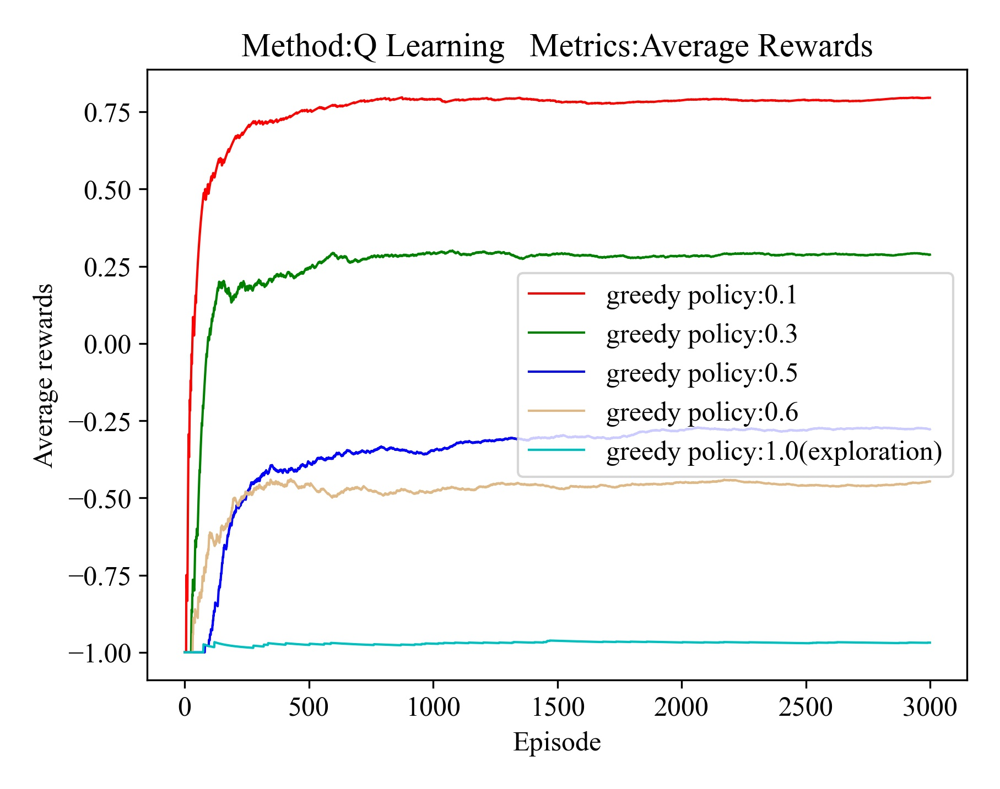
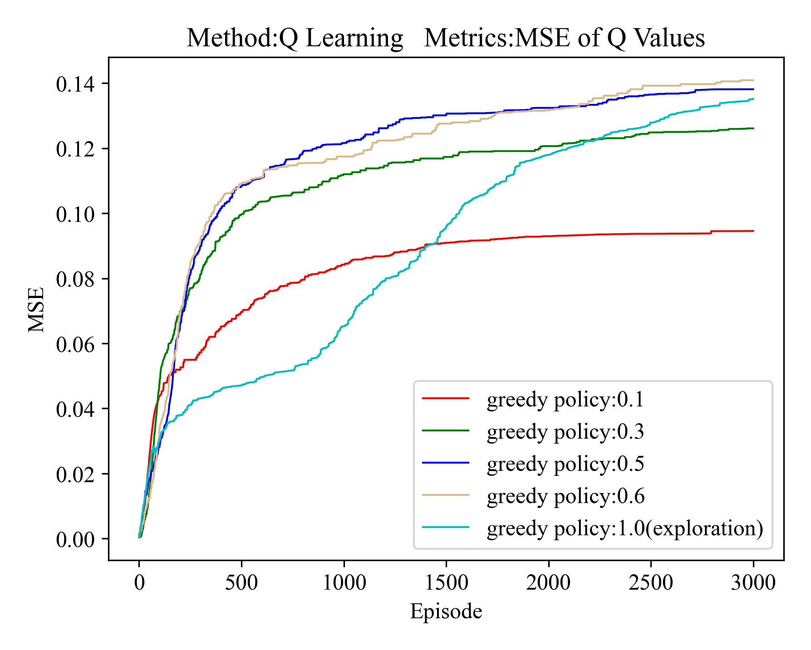
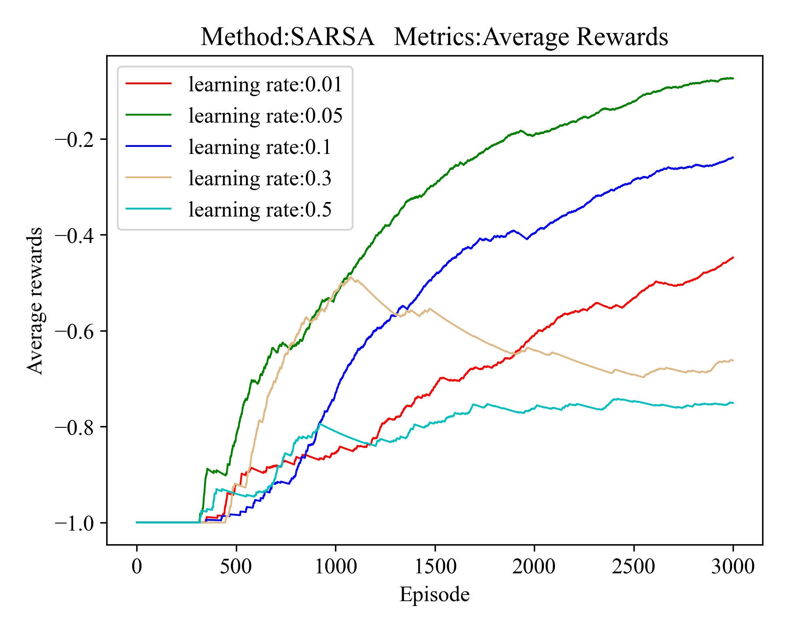
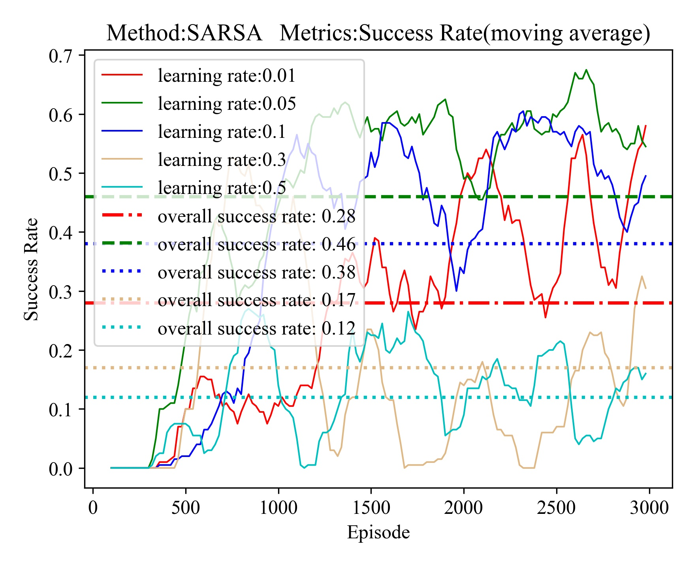
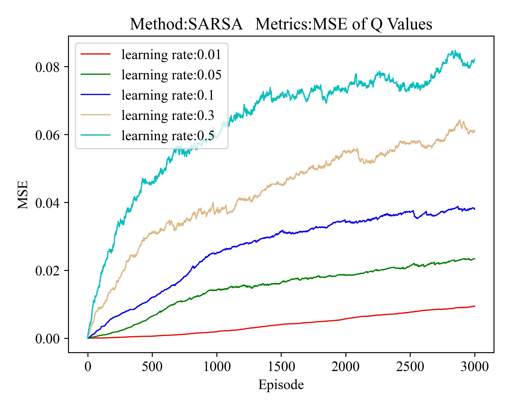
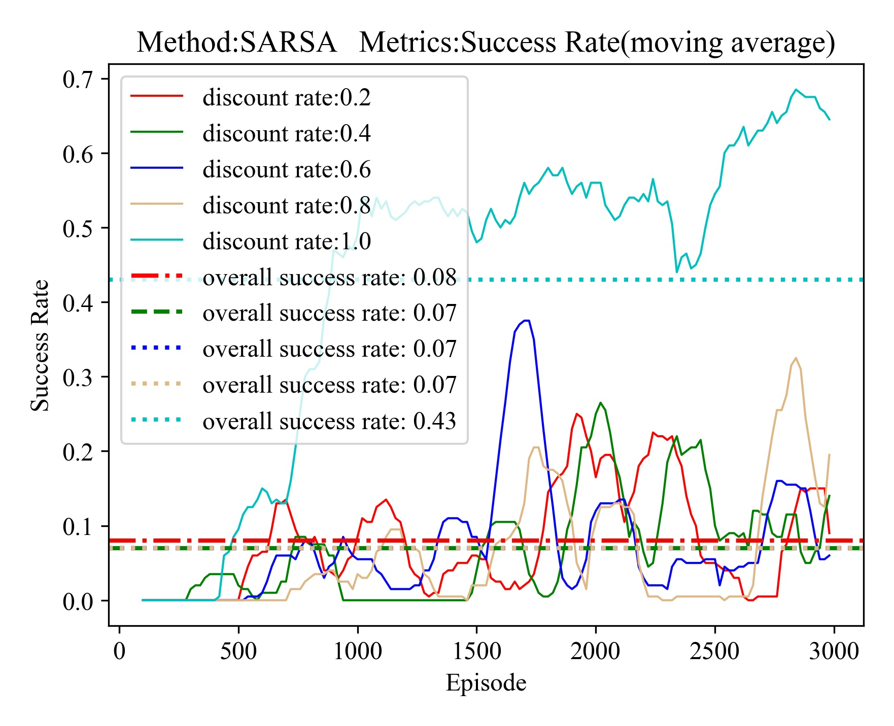

# ME5406_FrozenLake_FHL
(https://github.com/FHL1998/ME5406_FrozenLake_FHL)


## Project Description
> The objective of this project is to use model-free RL techniques to implement the **Frozen Lake Problem** and its extensions. 
> The problem is essentially a grid-world situation in which the agent’s target is to go from the start point(initial state) and reach the frisbee(goal & terminal state), 
> while avoiding slipping into ice holes(terminal states) on the frozen lake.

Python is typically used to build three algorithms using various variable structures:**First-Visit Monte Carlo**,**SARSA**, and **Q-learning**, where these methods are designed to find an optimal policy(i.e., _for control_)

## Map Generation & Environment Construction
The folder `map` contains what basic files need to construct environment. 
The `.txt` file  in `\map` contains the 4✖4 map and 10✖10 map: 
0 represents ice surface that agent be able to go though, 1 represents ice holes, 2 represents start point, 3 represents frisbee.
The visualization map can be illustrated as :

<div align=center>

</div>

## Project Execution 
 
 ### Virtual Environment Creation
 First, create the virtual environment using Anoconda and activate the created environment in Windows or Linux
 >At present the codes are only debuged in Windows 10, thus Windows 10 is recommended under this case.
 
 In Windows 10:
 ```python
   conda create -n frozenlake python=3.6
   conda activate frozenlake
```
In Ubuntu 18.04:
```python
  $ conda create -n frozenlake python=3.6
  $ source activate frozenlake
```
 ### Requirements Install  
The project based on the python version `Python 3.6.8`. For the requirements, a new virtual environmrnt is recommended. You should install the required packages in `requirements.txt` using:
```python
   pip install -r requirements.txt
```
 
 ### Detailed Execution  
 For the project execution, the prior preparation is the modification of parameters in `utils/Parameters.py`
 - **First**, modify the **MAP_NAME**, **MAP_SIZE** if you want to change the size of the grid world. The options are listed after the code.
 - **Second**, modify the hyper-parameters **NUM_STEPS**, **NUM_EPISODES**, **LEARNING_RATE**, **GAMMA**, and **EPSILON** if you want to adjust the maximum steps restriction in Monte Carlo method, the training episode number, the learning rate, the discount rate, and the epsilon greedy schedule during the training process.       
 - **Third**, `argparse` is uesd to add parser, you can run the entire project using the codes below to implement differnt tasks:
  
   - Run all the three methods separately.
   ```python
       python run.py 'ENV' 'Run Three Methods' 'None'
   ```
   
   - Run all the three methods together to compare the overall performance achieved by three methods.
   ```python
       python run.py 'ENV' 'Compare Three Methods' 'None'
   ```
   
   - For the task of tuning for Q Leatning, execute sub tuning tasks, which are Tuning Learning Rate, Tuning Discount Rate, and Tuning Greedy Policy.
   ```python
       python run.py 'ENV' 'Tuning Q Learning' 'Tuning Learning Rate'
       python run.py 'ENV' 'Tuning Q Learning' 'Tuning Discount Rate'
       python run.py 'ENV' 'Tuning Q Learning' 'Tuning Greedy Policy'
   ```
   
   - For the task of tuning for SARSA, execute sub tuning tasks separately, which are Tuning Learning Rate, Tuning Discount Rate, and Tuning Greedy Policy.
   ```python
       python run.py 'ENV' 'Tuning SARSA' 'Tuning Learning Rate'
       python run.py 'ENV' 'Tuning SARSA' 'Tuning Discount Rate'
       python run.py 'ENV' 'Tuning SARSA' 'Tuning Greedy Policy'
   ```
   
   > Noted: The training process can be aborted by `Ctrl+C`. In order to debug, you can utilize `python -m pdb run.py`.
    
## GUI Implementation using Tkinter and Web-App  
* if you want to use GUI with Tkinter, you must modify the code in `Q_learning.py`, `SARSA.py`, `Monte_Carlo.py`:
   - **First**, uncomment the code `self.env.render()` in each algorithm.
   - **Second**, uncomment the code `env.mainloop()` in `run.py` or in each algorithm if you want to debug.
   - **Third**, repeat the steps in **Project Execution**, one simple usage is:
     ```python
     python run.py 'GUI' 'Compare Three Methods' 'None'
     ```
* if you want to use **web-app**, just click on the text [**web app**](https://share.streamlit.io/fanielts8/frozen_lake_web/main/app.py) and follow the instruction.

## Project Structure
* ME5406 Project1
    * images. This folder includes the images to be used in building the GUI.
    * map
        ```python
        cd map 
        python map_process.py
        ```
        * `map_4x4.txt` and `map_10x10.txt`, which store the relevant positions of ice surface(0), start point(2), ice holes(1) and frisbee(3).
        * `map_process.py` used to process the `.txt` file. run
        
    * Monte Carlo
        * `Monte_Carlo.py`. Run the file to see the independent performance of using **First Meet Monte Carlo**.
    * Q_Learning
        * `Q_learning.py`. Run the file to see the independent performance of using **Q Learning**.
        * `Q_tunning.py`. Run the file to tune the hyper-parameter like discount rate, learning rate and epsilon and compare the performance.
    * SARSA
        * `SARSA.py`. Run the file to see the independent performance of using **SARSA**.
        * `SARSA_tunning.py`. Run the file to tune the hyper-parameter like discount rate, learning rate and epsilon and compare the performance.
        * `SARSA_epsilon.py`. The project try to improve the stability of SARSA using two different dynamic epsilon schedule.
    * SARSA_lambda
        * `SARSA_Lambda.py`. This is the improvement method of SARSA as well. Run the file to see the independent performance of using **SARSA(Lambda)**.
        * `compare_sarsa_lambda.py`. Run this file to compare the performance of SARSA and SARSA(lambda), thus reveal the improvement.
    * utils
        * `Parameters.py`. 
          * This file include all the important parameters and setting in the environment building process, such as grid size, pixels , image of agent in Tkinter, etc.
        * `Utils.py`. This include some functions which utilized to judge the convergence, plot figures like heat map, box plot, average rewards, time consuming, stpes and etc.
   * Environment
        * `Environment.py`. This file contains the relative operations to build the frozen lake environment.
   * Tkinter GUI
        * `GUI.py`. This file is used for Tkinter and contains the canvas settings, items representation and etc.


## Hyper Parameters Tuning Results Demonstration
Here, some of the results will be illustrated below, especially for `OVERALL_TASK = 'Tuning Q Learning'` and `OVERALL_TASK = 'Tuning SARSA'`. The overall results can be found in `results`. For the interpretation you can refer to the **Report** and `results`.
For the detailed interpretation of the hyper parametes:
- **Learning Rate(alpha)**: alpha is a metric that compares the outcomes of previous learning to the results of present learning. If the alpha is set too low, the agent will only be interested in prior information.
- **Discount Rate(gamma)**: gamma is the attenuation value for future returns, which determines the importance of future returns. A factor near to one will motivate the agent to work hard in order to reap long-term high benefits.
- **Greedy Policy(epsilon)**: epsilon is used to balance the relationship between exploration and exploitation in epsilon-greedy policy.

### Tuning Q Learning

#### Tuning Learning Rate in 10✖10 map
For *learning rate*, according to the results, the optimal one could be **0.1**, as higher average rewards, higher success rate, relative fast convergence(judged by MSE value) it achieved.

<div align=center>

</div>

#### Tuning Discount Rate in 10✖10 map
For *discount rate*, according to the results, the optimal one could be **0.8**, as higher average rewards, higher success rate, relative early success episode it achieved.

<div align=center>

</div>

#### Tuning Epsilon in 4✖4 map
For *epsilon*, in large scale map, a large epsilon will lead the Q Learning fail frequently. According to the results, the optimal epsilon value could be **0.1**, as highest average rewards, highest success rate, relative early success it achieved. In general, **Q Learning heavily depends on the epsilon**, a small epison value with **0.1** seems to be the 
optimal choice among all epsilon values.

<div align=center>

</div>
        
### Tuning SARSA

#### Tuning Learning Rate in 10✖10 map
For *learning rate*, according to the results, the optimal one could be **0.05** or **0.01**, as higher average rewards, higher success rate, relative fast convergence(judged by MSE value) it achieved.

<div align=center>

</div>

#### Tuning Discount Rate in 10✖10 map
For *discount rate*, although SARSA achieved best performance at **1.0**, it seems unrealistic in practical scenario, thus it is usually selected about **0.9**.

<div align=center>

</div>

#### Tuning Epsilon in 10✖10 map
For *epsilon*, according to the results, the optimal epsilon value could be **0.1**, as highest average rewards, highest success rate, relative early success it achieved.

<div align=center>

</div>


## GUI Implementation Result
### Tkinter GUI:

   The resluts achieved by using Q Learning in 10✖10 map is illustrated as below:
   <div align=center>
      
   </div>

   The resluts achieved by using SARSA in 10✖10 map is illustrated as below:
   <div align=center>
      
   </div>
   
### Web-App:
   <div align=center>
      
   </div>


## Project Iteration & Acknowledgement
The frozen lake problem is simple, yet it is extremely useful in understanding Reinforcement Learning's essential concept. This is an meaningful project, and I gain some assistance like GUI implementation(Tkinter) from [Morvan Zhou](https://github.com/MorvanZhou/Reinforcement-learning-with-tensorflow).

In addition to completing the project1, I also experimented with another GUI, which is implemented using [**web app**](https://share.streamlit.io/fanielts8/frozen_lake_web/main/app.py).

Finally, I'd want to express my heartfelt gratitude to [Professor CHEN Chao Yu, Peter](https://www.eng.nus.edu.sg/me/staff/chen-chao-yu-peter/) for teaching me approaches and abilities in ME5406. Your collection notes are informative, vivid, concise and clear, particularly the practical problem of the cliff walking, which helps me grasp the difference and link between SARSA and Q Learning, as well as the idea of DRL.
